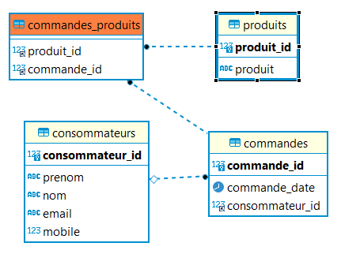

# application Spring Boot avec front Angular dans docker

La branche main présente les fichiers de développement et de production. La branche prod présente uniquement les fichiers utiles en production.  

```bash 
docker-compose up --build
```

## Base de données :  

  

La base de données est créée avec le build de l'image docker.

## Serveur :  
  
Le serveur est basé sur Spring Boot, Maven et JPA.

Les fichiers sources sont disponibles dans le dossier src. Si besoin de modification, l'url de développement de la base de données est à modifier dans application-properties, et un port doit être ouvert dans le docker-compose pour la base de données. Il faut remettre d'url initiale avant le build.

En cas de modification de l'url du serveur front, il faut mettre à jour les @Crossorigins dans le controlleur.

En cas de modification des sources, le build ne fonctionnera pas à cause de l'url de la base de données. Il faut donc générer un jar avec :

```bash
mvn clean install -DskipTests=true
```  

et copier le jar sous le nom demo1_1 dans le dossier parent.  

## Front : 

Les fichiers sources Angular sont dans le dossier front. Le serveur front pour docker est dans le dossier front-built.  

## Proxy : 

Le proxy Nginx redirige le localhost vers spring boot, soit le port 80 vers le port 8080. En cas de développement hors docker, il faut utiliser le port 8080.  